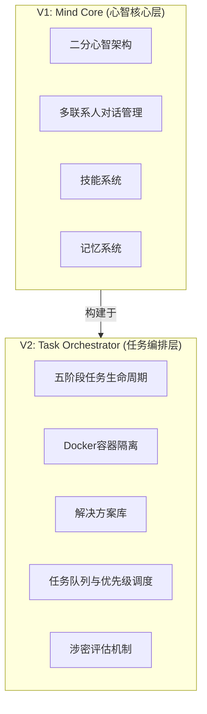

# Touwaka Mate

一个具备自我反思能力的AI助手系统，采用渐进式架构设计。

## 版本导航

| 版本 | 名称 | 状态 | 文档 |
|------|------|------|------|
| **V1** | [Mind Core / 心智核心](docs/v1/) | ✅ 已实现 | [查看文档](docs/v1/README.md) |
| **V2** | Task Orchestrator / 任务编排器 | 📝 设计中 | [查看设计](docs/v2/task-layer-design.md) |

## 架构演进



## 快速开始

### 运行 V1 (Mind Core)

```bash
# 安装依赖
npm install

# 配置数据库
cp .env.example .env
# 编辑 .env 填入数据库配置

# 初始化数据库
mysql -u root -p < scripts/init-database.sql

# 启动
EXPERT_ID=eric npm start
```

详细说明见 [V1 文档](docs/v1/README.md)。

## 项目特点

### V1 - Mind Core / 心智核心

- **二分心智架构**：Expressive Mind 生成回复，Reflective Mind 自我反思
- **多联系人对话**：一个专家副本可同时与多个联系人对话
- **技能系统**：支持文件系统/数据库双模式存储，动态加载
- **记忆系统**：Topic级语义索引，向量检索

### V2 - Task Orchestrator (设计中)

- **任务生命周期**：五阶段状态机，支持回滚
- **容器隔离**：不同阶段运行在不同Docker容器
- **解决方案库**：预定义任务流程，标准化输入输出
- **优先级调度**：任务队列，夜间模式，涉密任务特殊处理

## 参考分析

- [开源项目分析报告](docs/references-analysis-report.md) - NanoClaw/OpenClaw/PicoClaw/ZeroClaw 深度对比
- [V1 改进建议](docs/improvement-suggestions.md)

## 许可证

MIT
