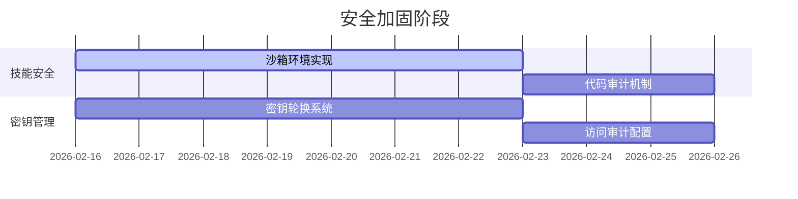
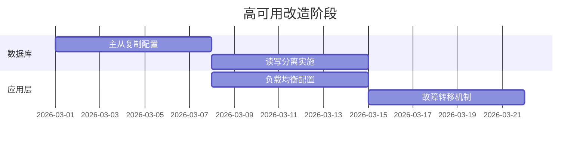
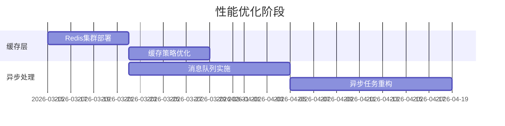

# Chat Expert Instance 系统架构改进建议

## 整体评价：B+（良好，有改进空间）

这是一个具有创新性的AI专家系统架构，二分心智设计理念独特且实用。架构在功能完整性和扩展性方面表现良好，但在安全性、可靠性和运维成熟度方面需要重点改进。

## 核心优势

1. **创新性设计**：二分心智架构（Expressive Mind + Reflective Mind）概念新颖，理论基础扎实
2. **模块化程度高**：各组件职责清晰，耦合度低，便于维护
3. **扩展性良好**：支持水平扩展和多专家部署，配置驱动设计
4. **成本优化**：不同心智使用不同模型，有效控制成本

## 关键风险点

### 高风险（P0 - 立即处理）

#### 1. 安全风险
**问题描述**：
- `vm.runInContext` 执行动态代码存在严重安全隐患
- 技能代码可能包含恶意逻辑
- 缺少代码审计机制

**改进方案**：
```javascript
// 建议的技能执行沙箱
class SkillSandbox {
  constructor(skillCode, resourceLimits) {
    this.vm = new VM({
      timeout: resourceLimits.timeout || 5000,
      sandbox: {
        console: this.createSecureConsole(),
        require: this.createSecureRequire(),
        // 限制全局对象访问
        process: undefined,
        global: undefined
      }
    });
  }
  
  createSecureConsole() {
    return {
      log: (...args) => this.secureLog('info', args),
      error: (...args) => this.secureLog('error', args)
    };
  }
  
  createSecureRequire() {
    const allowedModules = ['lodash', 'axios', 'moment'];
    return (module) => {
      if (!allowedModules.includes(module)) {
        throw new Error(`Module ${module} is not allowed`);
      }
      return require(module);
    };
  }
}
```

#### 2. 单点故障
**问题描述**：
- 数据库成为系统单点故障点
- 缺少故障转移机制
- 数据备份策略不明确

**改进方案**：
```yaml
# 高可用数据库架构
database:
  master:
    host: db-master
    port: 3306
  slaves:
    - host: db-slave-1
      port: 3306
    - host: db-slave-2
      port: 3306
  backup:
    schedule: "0 2 * * *"  # 每天凌晨2点备份
    retention: 30  # 保留30天
```

#### 3. API密钥管理
**问题描述**：
- 数据库存储API密钥，加密机制不明确
- 缺少密钥轮换机制
- 访问审计不完善

**改进方案**：
```javascript
// 密钥管理服务
class KeyManagementService {
  constructor() {
    this.vault = new HashiCorpVault();
    this.rotationInterval = 30 * 24 * 60 * 60 * 1000; // 30天
  }
  
  async getApiKey(providerId) {
    const encrypted = await this.db.getProviderKey(providerId);
    return await this.vault.decrypt(encrypted);
  }
  
  async rotateApiKey(providerId) {
    const newKey = await this.generateNewKey(providerId);
    const encrypted = await this.vault.encrypt(newKey);
    await this.db.updateProviderKey(providerId, encrypted);
    await this.audit.log('key_rotated', { providerId, timestamp: Date.now() });
  }
}
```

### 中等风险（P1 - 短期规划）

#### 4. 性能瓶颈
**问题描述**：
- LLM调用延迟影响用户体验
- 数据库查询性能限制
- 内存管理可能溢出

**改进方案**：
```javascript
// 异步处理架构
class AsyncProcessor {
  constructor() {
    this.redis = new Redis();
    this.queue = new Bull('llm-calls');
  }
  
  async processReflectiveMind(data) {
    return this.queue.add('reflect', data, {
      delay: 1000, // 延迟1秒执行
      attempts: 3,
      backoff: 'exponential'
    });
  }
  
  async processWithCache(key, fn, ttl = 300) {
    const cached = await this.redis.get(key);
    if (cached) return JSON.parse(cached);
    
    const result = await fn();
    await this.redis.setex(key, ttl, JSON.stringify(result));
    return result;
  }
}
```

#### 5. 监控缺失
**问题描述**：
- 缺少完整的监控告警体系
- 业务指标监控不足
- 故障排查困难

**改进方案**：
```yaml
# 监控配置
monitoring:
  prometheus:
    scrape_interval: 15s
    evaluation_interval: 15s
  
  grafana:
    dashboards:
      - system-metrics
      - business-metrics
      - llm-performance
  
  alerts:
    - name: HighErrorRate
      condition: error_rate > 0.05
      duration: 5m
    - name: HighLatency
      condition: llm_latency > 5000ms
      duration: 2m
```

#### 6. 数据一致性
**问题描述**：
- 并发操作可能导致数据不一致
- 缺少分布式事务处理
- 缓存一致性策略缺失

**改进方案**：
```javascript
// 分布式锁和事务管理
class DistributedTransactionManager {
  constructor() {
    this.redis = new Redis();
  }
  
  async withLock(key, fn, timeout = 10000) {
    const lockKey = `lock:${key}`;
    const lockValue = uuidv4();
    
    const acquired = await this.redis.set(lockKey, lockValue, 'PX', timeout, 'NX');
    if (!acquired) {
      throw new Error(`Failed to acquire lock for ${key}`);
    }
    
    try {
      return await fn();
    } finally {
      await this.redis.releaseLock(lockKey, lockValue);
    }
  }
}
```

## 架构演进路线图

### 第一阶段：安全加固（2周）


### 第二阶段：高可用改造（3周）


### 第三阶段：性能优化（4周）


### 第四阶段：监控体系（3周）


## 具体实施建议

### 1. 立即行动项（本周内）
- [ ] 禁用或限制技能动态执行功能
- [ ] 实施数据库备份策略
- [ ] 建立基础日志收集
- [ ] 进行安全漏洞扫描

### 2. 短期目标（1个月内）
- [ ] 完成技能沙箱环境
- [ ] 实施数据库主从复制
- [ ] 建立基础监控体系
- [ ] 完善错误处理机制

### 3. 中期目标（3个月内）
- [ ] 完成性能优化改造
- [ ] 建立完整的监控告警
- [ ] 实施CI/CD流水线
- [ ] 完善文档和测试

### 4. 长期目标（6个月内）
- [ ] 微服务化改造
- [ ] 引入服务网格
- [ ] 建立技能生态
- [ ] 实施多地域部署

## 技术债务清理

### 代码质量
- 单元测试覆盖率提升至80%+
- 集成测试自动化
- 代码审查流程标准化
- 静态代码分析集成

### 文档完善
- API文档自动生成
- 架构决策记录（ADR）
- 运维手册编写
- 故障处理手册

### 工具链建设
- 开发环境标准化
- 部署脚本自动化
- 监控工具集成
- 性能测试工具

## 成功指标

### 技术指标
- 系统可用性：99.9%+
- 响应时间：P95 < 2秒
- 错误率：< 0.1%
- 安全漏洞：0个高危

### 业务指标
- 部署频率：每周1次
- 故障恢复时间：< 30分钟
- 开发效率：提升50%
- 运维成本：降低30%

## 风险控制

### 技术风险
- 保持向后兼容性
- 渐进式重构策略
- 灰度发布机制
- 快速回滚能力

### 项目风险
- 定期架构评审
- 技术决策记录
- 团队技能培训
- 外部专家咨询

## 总结

这个架构设计具有很好的创新性和实用价值，二分心智的概念在AI系统中是独特的尝试。当前架构在功能设计上相对完整，但在工程实践方面还需要重点改进。

建议按照优先级逐步实施改进，优先解决安全隐患和高可用问题，然后逐步完善监控体系和性能优化。保持架构简洁性的同时，确保系统的安全性和可靠性是成功的关键。

通过系统性的改进，这个架构有潜力成为一个稳定、可扩展、易维护的AI专家系统平台。