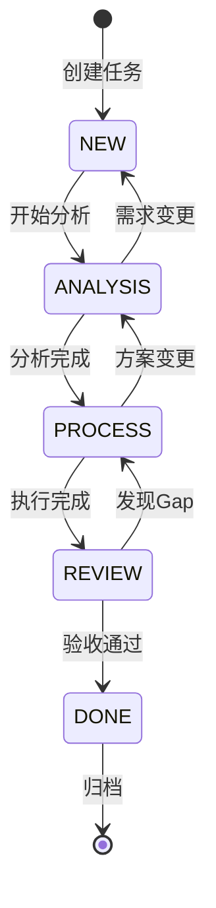

# Touwaka Mate V2 - Task Layer 设计文档

## 文档说明

本文档定义V2版本中Task层的设计，基于V1多用户对话能力的扩展，增加任务编排、约束管理和多专家协作能力。

---

## 1. 核心概念

### 1.1 Topic-Task 关系

```
┌─────────────────────────────────────────┐
│  Task (工作单元)                          │
│  ├── Topic 1: 需求讨论 (ANALYSIS阶段)      │
│  ├── Topic 2: 技术方案选择 (ANALYSIS阶段)   │
│  ├── Topic 3: 代码实现问题 (PROCESS阶段)    │
│  └── Topic 4: 结果验收 (REVIEW阶段)        │
└─────────────────────────────────────────┘
```

**设计原则：**
- **Task** 是用户显式创建的工作单元，有明确目标和边界
- **Topic** 是Task内的一次讨论主题，在总结对话时自动生成
- 用户可以在Task中闲聊，但会被识别并建议回到正题

### 1.2 与V1的对比

| 维度 | V1 (当前) | V2 (Task Layer) |
|------|----------|-----------------|
| 对话组织 | Session → Messages | Task → Topics → Messages |
| 文件操作 | 直接读写 | 阶段化目录隔离 |
| AI约束 | 依赖提示词 | 规划-执行-Review循环 |
| 技能加载 | 固定技能集 | RAG动态召回 |
| 执行隔离 | 无 | Docker容器 |

---

## 2. Task 生命周期

### 2.1 五阶段状态机



### 2.2 阶段说明

| 状态 | 目录 | 职责 | 产出物 |
|------|------|------|--------|
| `NEW` | `00-requirements/` | 需求收集与确认 | `input.md`, 上传文件 |
| `ANALYSIS` | `01-analysis/` | 需求分析与方案设计 | `plan.md`, `tech_design.md` |
| `PROCESS` | `02-process/` | 任务执行 | 代码/数据/中间结果 |
| `REVIEW` | `03-review/` | 结果审核与差距分析 | `report.md`, `gap_report.md` |
| `DONE` | `04-output/` | 最终交付 | `final_report.*` |

### 2.3 状态流转规则

- **默认自动流转**：各阶段完成后自动推进到下一阶段
- **用户干预**：用户可随时"叫停"、"回滚"或"强制完成"
- **回滚触发**：Review阶段发现Gap → 生成`gap_report.md` → 回滚到PROCESS

---

## 3. 约束机制（防止执行走形）

### 3.1 三道防线

```
第一道：任务创建约束
├── 创建前禁止文件操作（只能对话）
├── 解决方案库匹配 → 标准化输入表单
└── 开放任务 → 需求澄清对话直到明确

第二道：执行阶段约束
├── 五阶段目录隔离（文件系统级）
├── Reflective Mind监督（认知级）
│   └── 每轮检测：当前行为 vs 任务目标
└── 计划-执行分离（流程级）
    └── Analyst制定plan → Worker严格执行

第三道：审核阶段约束
├── Reviewer对照需求验收
├── Gap检测 → 强制回滚
└── 用户最终确认
```

### 3.2 Reflective Mind 在Task中的角色

```javascript
// lib/reflective-mind.js (V2扩展)
class ReflectiveMind {
    async evaluateTaskProgress(task, currentMessages) {
        // 1. 提取任务目标
        const goal = task.description;
        
        // 2. 分析当前行为
        const currentBehavior = this.analyzeBehavior(currentMessages);
        
        // 3. 计算偏离度
        const deviation = await this.calculateDeviation(goal, currentBehavior);
        
        // 4. 如果偏离度过高，生成提醒
        if (deviation.score > 0.7) {
            return {
                shouldIntervene: true,
                suggestion: `当前讨论偏离任务目标。建议回到：${goal}`,
                nextAction: 'refocus'
            };
        }
        
        // 5. 检测兜圈子
        if (this.isCircularDiscussion(currentMessages)) {
            return {
                shouldIntervene: true,
                suggestion: '检测到重复讨论，建议推进到下一步',
                nextAction: 'advance'
            };
        }
    }
}
```

---

## 4. 目录与存储结构

### 4.1 Task 物理目录

```
/workspace/tasks/T_{YYYYMMDD}_{ID}_{slug}/
├── task.json              # 任务元数据
├── 00-requirements/       # 需求阶段
│   ├── input.md          # 用户输入（AI整理后的需求）
│   ├── uploads/          # 用户上传文件
│   └── chat_history.json # 阶段对话记录
├── 01-analysis/           # 分析阶段
│   ├── plan.md           # 执行计划
│   ├── tech_design.md    # 技术方案
│   └── chat_history.json
├── 02-process/            # 执行阶段
│   ├── work/             # 工作目录
│   ├── interim/          # 中间结果
│   └── chat_history.json
├── 03-review/             # 审核阶段
│   ├── report.md         # 审核报告
│   └── gap_report.md     # 差距分析（如有）
└── 04-output/             # 输出阶段
    └── final/            # 最终交付物
```

### 4.2 数据库表设计

```sql
-- tasks 表
CREATE TABLE tasks (
    id INT PRIMARY KEY AUTO_INCREMENT,
    task_id VARCHAR(100) UNIQUE NOT NULL COMMENT '任务唯一标识 TYYYYMMDD_XXX',
    title VARCHAR(200) NOT NULL COMMENT '任务标题',
    description TEXT COMMENT '任务描述/目标',
    type ENUM('solution', 'open') NOT NULL COMMENT '任务类型：预定义方案 / 开放任务',
    solution_id VARCHAR(100) COMMENT '关联的解决方案ID（如适用）',
    status ENUM('NEW', 'ANALYSIS', 'PROCESS', 'REVIEW', 'DONE', 'FAILED') DEFAULT 'NEW',
    work_dir VARCHAR(500) NOT NULL COMMENT '物理工作目录',
    current_phase VARCHAR(20) COMMENT '当前阶段',
    created_by VARCHAR(100) COMMENT '创建者',
    created_at TIMESTAMP DEFAULT CURRENT_TIMESTAMP,
    updated_at TIMESTAMP DEFAULT CURRENT_TIMESTAMP ON UPDATE CURRENT_TIMESTAMP,
    INDEX idx_task_id (task_id),
    INDEX idx_status (status)
);

-- task_topics 表（Task内的讨论主题）
CREATE TABLE task_topics (
    id INT PRIMARY KEY AUTO_INCREMENT,
    topic_id VARCHAR(100) UNIQUE NOT NULL,
    task_id VARCHAR(100) NOT NULL COMMENT '所属Task',
    phase VARCHAR(20) NOT NULL COMMENT 'ANALYSIS/PROCESS/REVIEW',
    title VARCHAR(200) COMMENT '主题标题',
    summary TEXT COMMENT '主题总结',
    created_at TIMESTAMP DEFAULT CURRENT_TIMESTAMP,
    FOREIGN KEY (task_id) REFERENCES tasks(task_id),
    INDEX idx_task_phase (task_id, phase)
);

-- task_messages 表（消息与Topic关联）
ALTER TABLE messages ADD COLUMN task_id VARCHAR(100) COMMENT '所属Task（如适用）';
ALTER TABLE messages ADD COLUMN topic_id VARCHAR(100) COMMENT '所属Topic（如适用）';
ALTER TABLE messages ADD COLUMN phase VARCHAR(20) COMMENT '消息产生的阶段';
```

---

## 5. Docker 容器隔离

### 5.1 容器角色

| 角色 | 生命周期 | 挂载目录 | 职责 |
|------|----------|----------|------|
| **Butler** | 长期运行 | 只读访问所有Task | 协调、与用户对话、决策 |
| **Analyst** | 按需创建 | 00-req(RO), 01-ana(RW) | 需求分析、生成plan |
| **Worker** | 按需创建 | 00-req(RO), 01-ana(RO), 02-pro(RW) | 执行plan、生成产出 |
| **Reviewer** | 按需创建 | 00-req(RO), 02-pro(RO), 03-rev(RW), 04-out(RW) | 审核、生成report |

### 5.2 容器启动配置

```javascript
// Analyst 容器
{
    name: `analyst-${taskId}`,
    image: 'touwaka-expert:latest',
    env: {
        ROLE: 'analyst',
        TASK_ID: taskId,
        PHASE: 'ANALYSIS'
    },
    binds: [
        `${taskDir}/00-requirements:/input:ro`,
        `${taskDir}/01-analysis:/workspace:rw`
    ]
}

// Worker 容器
{
    name: `worker-${taskId}`,
    env: { ROLE: 'worker', PHASE: 'PROCESS' },
    binds: [
        `${taskDir}/00-requirements:/input:ro`,
        `${taskDir}/01-analysis:/plan:ro`,
        `${taskDir}/02-process:/workspace:rw`
    ]
}
```

### 5.3 容器与主进程通信协议（API + SSE）

容器内的Expert需要与主进程通信以调用工具、上报进度。采用REST API + Server-Sent Events混合方案：

```
┌─────────────────────────────────────────────────────────────┐
│                    通信架构                                  │
├─────────────────────────────────────────────────────────────┤
│                                                             │
│  ┌─────────────┐    API Call     ┌─────────────────────┐   │
│  │   Analyst   │ ──────────────→ │   Main Process      │   │
│  │   Worker    │  HTTP POST/GET  │   (Butler核心)       │   │
│  │  Container  │ ←────────────── │                     │   │
│  └─────────────┘   API Response  └─────────────────────┘   │
│         │                            │                      │
│         │                            │                      │
│         └──── SSE Stream ────────────┘                      │
│                                                             │
│  - 工具调用/状态查询：同步HTTP API                           │
│  - 进度推送/实时通知：单向SSE流                              │
│                                                             │
└─────────────────────────────────────────────────────────────┘
```

**API 端点设计：**

```javascript
// lib/container-api.js - 主进程提供的API
const express = require('express');
const router = express.Router();

// 工具调用（同步）
router.post('/api/v1/tools/:toolName', async (req, res) => {
    const { taskId, params } = req.body;
    const result = await toolManager.execute(req.params.toolName, params, taskId);
    res.json({ success: true, result });
});

// 文件操作（同步）
router.post('/api/v1/files/read', async (req, res) => {
    const { taskId, path } = req.body;
    const content = await fileManager.read(taskId, path);
    res.json({ success: true, content });
});

// 状态更新（同步响应 + SSE推送）
router.post('/api/v1/tasks/:taskId/status', async (req, res) => {
    const { status, message } = req.body;
    await taskManager.updateStatus(req.params.taskId, status, message);
    
    // 同时通过SSE推送给前端
    sseManager.broadcast(req.params.taskId, {
        type: 'status_update',
        status,
        message,
        timestamp: Date.now()
    });
    
    res.json({ success: true });
});

// SSE 连接端点（实时流）
router.get('/api/v1/events/:taskId', (req, res) => {
    res.setHeader('Content-Type', 'text/event-stream');
    res.setHeader('Cache-Control', 'no-cache');
    res.setHeader('Connection', 'keep-alive');
    
    const clientId = sseManager.subscribe(req.params.taskId, (event) => {
        res.write(`data: ${JSON.stringify(event)}\n\n`);
    });
    
    req.on('close', () => {
        sseManager.unsubscribe(clientId);
    });
});
```

**容器内SDK（Expert使用）：**

```javascript
// sdk/container-client.js - 容器内Expert调用的客户端
class ContainerClient {
    constructor() {
        this.apiBase = process.env.MAIN_PROCESS_API || 'http://host.docker.internal:3000';
        this.taskId = process.env.TASK_ID;
        this.sseConnection = null;
    }
    
    // 调用工具（同步HTTP）
    async callTool(toolName, params) {
        const response = await fetch(`${this.apiBase}/api/v1/tools/${toolName}`, {
            method: 'POST',
            headers: { 'Content-Type': 'application/json' },
            body: JSON.stringify({ taskId: this.taskId, params })
        });
        return await response.json();
    }
    
    // 上报进度（HTTP + SSE）
    async reportProgress(progress, message) {
        await fetch(`${this.apiBase}/api/v1/tasks/${this.taskId}/status`, {
            method: 'POST',
            headers: { 'Content-Type': 'application/json' },
            body: JSON.stringify({ 
                status: 'running',
                progress,
                message 
            })
        });
    }
    
    // 流式输出（SSE）
    streamOutput(chunk) {
        // 通过stdout的特殊格式或HTTP SSE发送
        process.stdout.write(`\x1b]1337;Stream=${JSON.stringify(chunk)}\x07`);
    }
}
```

**选择API+SSE而非WebSocket的原因：**
- **简单可靠**：HTTP API成熟稳定，容器到主进程的连接明确
- **单向为主**：Expert主要是"上报结果"，不需要双向实时通信
- **易于调试**：可以通过curl直接调用API测试
- **兼容性好**：SSE在容器环境下穿透性优于WebSocket

---

## 6. 技能加载策略（开放任务）

### 6.1 核心问题

开放任务没有预定义的解决方案，需要AI动态选择合适的技能。

### 6.2 解决方案：System Prompt 工具箱

```javascript
// lib/context-manager.js - V2版本
class ContextManager {
    async buildOpenTaskContext(task, messages) {
        // 1. 基础系统提示
        const basePrompt = this.loadBasePrompt();
        
        // 2. 【动态】技能工具箱
        const skillToolbox = await this.buildSkillToolbox(task, messages);
        
        // 3. 任务目标锁定
        const taskGoal = `## 当前任务目标\n${task.description}\n\n当前阶段: ${task.current_phase}`;
        
        // 组装系统提示
        const systemPrompt = `${basePrompt}

${skillToolbox}

${taskGoal}`;

        return [
            { role: 'system', content: systemPrompt },
            ...messages  // 干净的对话历史
        ];
    }

    async buildSkillToolbox(task, messages) {
        const turnCount = messages.filter(m => m.role === 'user').length;
        
        // 策略1：初始阶段广泛检索
        if (turnCount <= 2) {
            const query = `${task.description} ${messages[0]?.content || ''}`;
            const skills = await skillLoader.vectorSearch(query, topK = 10);
            return this.formatToolbox(skills, '候选技能（请选择使用）');
        }
        
        // 策略2：基于已用技能收敛
        const usedSkills = this.extractUsedSkills(messages);
        if (usedSkills.length > 0) {
            const related = await skillLoader.findRelated(usedSkills);
            return this.formatToolbox(
                [...usedSkills, ...related],
                '活跃技能及相关工具'
            );
        }
        
        // 默认保持
        return this.getCurrentToolbox();
    }
}
```

### 6.3 技能工具箱格式

```markdown
## 可用技能工具箱

### 文件操作
- `read_file(path)` - 读取文件内容
- `write_file(path, content)` - 写入文件

### 数据处理
- `csv_query(file, sql)` - SQL查询CSV
- `json_transform(data, jq)` - JQ转换JSON

### 网络
- `web_search(query)` - 搜索网络
- `fetch_url(url)` - 获取网页

[技能会随着对话进展动态调整]
```

---

## 7. 解决方案库（Solution Library）

### 7.1 概念

预定义的"组合技能"，针对常见任务场景提供标准化流程。

### 7.2 解决方案库数据库设计

解决方案库存储在数据库中，支持热更新和版本管理。

```sql
-- solutions 表（解决方案定义）
CREATE TABLE solutions (
    id INT PRIMARY KEY AUTO_INCREMENT,
    solution_id VARCHAR(100) UNIQUE NOT NULL COMMENT '解决方案唯一标识',
    name VARCHAR(200) NOT NULL COMMENT '显示名称',
    description TEXT COMMENT '解决方案描述',
    category VARCHAR(50) COMMENT '分类（数据处理/文档生成/代码开发等）',
    
    -- 优先级与调度
    priority INT DEFAULT 5 COMMENT '默认优先级 1-10',
    estimated_duration_minutes INT COMMENT '预计处理时长（分钟）',
    
    -- 涉密标记
    sensitivity_level VARCHAR(20) DEFAULT 'low' COMMENT '涉密等级: low/medium/high',
    
    -- 启用状态
    is_active BOOLEAN DEFAULT TRUE,
    version VARCHAR(20) DEFAULT '1.0.0',
    created_at TIMESTAMP DEFAULT CURRENT_TIMESTAMP,
    updated_at TIMESTAMP DEFAULT CURRENT_TIMESTAMP ON UPDATE CURRENT_TIMESTAMP,
    
    INDEX idx_solution_id (solution_id),
    INDEX idx_category (category),
    INDEX idx_active (is_active)
);

-- solution_input_fields 表（输入表单定义）
CREATE TABLE solution_input_fields (
    id INT PRIMARY KEY AUTO_INCREMENT,
    solution_id VARCHAR(100) NOT NULL COMMENT '所属解决方案',
    field_name VARCHAR(100) NOT NULL COMMENT '字段名',
    field_type ENUM('text', 'textarea', 'select', 'file', 'number', 'boolean') NOT NULL,
    label VARCHAR(200) COMMENT '显示标签',
    description TEXT COMMENT '字段说明',
    is_required BOOLEAN DEFAULT FALSE,
    
    -- 选项配置（用于select类型）
    options_json TEXT COMMENT '选项列表 JSON ["option1", "option2"]',
    default_value TEXT COMMENT '默认值',
    
    -- 文件限制（用于file类型）
    file_accept VARCHAR(200) COMMENT '接受文件类型 .pdf,.docx',
    file_max_size_mb INT DEFAULT 10 COMMENT '最大文件大小MB',
    
    sort_order INT DEFAULT 0 COMMENT '排序顺序',
    
    FOREIGN KEY (solution_id) REFERENCES solutions(solution_id),
    INDEX idx_solution_field (solution_id, field_name)
);

-- solution_steps 表（执行步骤定义）
CREATE TABLE solution_steps (
    id INT PRIMARY KEY AUTO_INCREMENT,
    solution_id VARCHAR(100) NOT NULL COMMENT '所属解决方案',
    step_number INT NOT NULL COMMENT '步骤序号',
    phase ENUM('ANALYSIS', 'PROCESS', 'REVIEW') NOT NULL COMMENT '所属阶段',
    
    name VARCHAR(200) NOT NULL COMMENT '步骤名称',
    description TEXT COMMENT '步骤描述',
    expert_role VARCHAR(50) NOT NULL COMMENT '执行专家: analyst/worker/reviewer',
    
    -- 所需技能（多个）
    required_skills_json TEXT NOT NULL COMMENT '所需技能列表 ["skill1", "skill2"]',
    
    -- 提示词模板
    system_prompt_template TEXT COMMENT '系统提示词模板',
    user_prompt_template TEXT COMMENT '用户提示词模板',
    
    -- 验收标准
    acceptance_criteria TEXT COMMENT '验收标准描述',
    
    -- 超时设置
    timeout_minutes INT DEFAULT 30 COMMENT '步骤超时时间',
    
    FOREIGN KEY (solution_id) REFERENCES solutions(solution_id),
    INDEX idx_solution_step (solution_id, step_number)
);

-- solution_step_outputs 表（步骤产出物定义）
CREATE TABLE solution_step_outputs (
    id INT PRIMARY KEY AUTO_INCREMENT,
    solution_id VARCHAR(100) NOT NULL,
    step_number INT NOT NULL COMMENT '对应步骤',
    
    output_name VARCHAR(100) NOT NULL COMMENT '产出物名称',
    output_type ENUM('file', 'directory', 'report', 'data') NOT NULL,
    file_pattern VARCHAR(200) COMMENT '文件匹配模式 *.md, report.pdf',
    is_required BOOLEAN DEFAULT TRUE COMMENT '是否必须产出',
    validation_rules TEXT COMMENT '验证规则 JSON',
    
    FOREIGN KEY (solution_id) REFERENCES solutions(solution_id)
);
```

### 7.3 解决方案定义示例

以"PDF转分析报告"为例，数据库中的完整定义：

```sql
-- 解决方案主记录
INSERT INTO solutions (solution_id, name, description, category, 
    priority, estimated_duration_minutes, sensitivity_level) 
VALUES (
    'pdf-to-report',
    'PDF转分析报告',
    '读取PDF内容并生成结构化分析报告，支持多种输出格式',
    '文档生成',
    5,           -- 中等优先级
    30,          -- 预计30分钟
    'medium'     -- 可能涉及敏感文档
);

-- 输入字段定义
INSERT INTO solution_input_fields (solution_id, field_name, field_type, 
    label, description, is_required, file_accept, sort_order) VALUES
('pdf-to-report', 'pdf_file', 'file', 'PDF文件', '需要分析的PDF文档', 
    TRUE, '.pdf', 1),
('pdf-to-report', 'analysis_focus', 'select', '分析重点', '选择分析深度', 
    TRUE, NULL, 2),
('pdf-to-report', 'output_format', 'select', '输出格式', '报告输出格式', 
    TRUE, NULL, 3),
('pdf-to-report', 'additional_notes', 'textarea', '补充说明', '其他特殊要求', 
    FALSE, NULL, 4);

-- 选项配置（通过JSON存储）
UPDATE solution_input_fields 
SET options_json = '["summary", "detailed", "critical"]',
    default_value = 'summary'
WHERE solution_id = 'pdf-to-report' AND field_name = 'analysis_focus';

-- 执行步骤
INSERT INTO solution_steps (solution_id, step_number, phase, name, 
    description, expert_role, required_skills_json, system_prompt_template) VALUES
('pdf-to-report', 1, 'ANALYSIS', 'PDF内容提取',
 '提取PDF文本内容，识别文档结构和关键信息',
 'analyst',
 '["pdf_reader", "text_extraction"]',
 '你是一个文档分析专家。请提取PDF的关键信息，包括：主题、关键论点、数据结构...'),

('pdf-to-report', 2, 'ANALYSIS', '内容分析',
 '分析提取的内容，识别重点和逻辑结构',
 'analyst', 
 '["text_analysis", "data_extraction"]',
 '基于提取的内容，进行深入分析...'),

('pdf-to-report', 3, 'PROCESS', '报告生成',
 '基于分析结果生成结构化报告',
 'worker',
 '["report_writer", "chart_generator", "markdown_format"]',
 '你是一个报告撰写专家。根据分析结果生成{{output_format}}格式的报告...'),

('pdf-to-report', 4, 'REVIEW', '质量审核',
 '检查报告完整性和准确性',
 'reviewer',
 '["quality_check", "fact_verification"]',
 '审核报告是否完整覆盖了PDF的关键信息...');

-- 产出物定义
INSERT INTO solution_step_outputs (solution_id, step_number, output_name, 
    output_type, file_pattern, is_required) VALUES
('pdf-to-report', 1, 'extracted_content', 'file', '01-analysis/extracted.json', TRUE),
('pdf-to-report', 2, 'analysis_notes', 'file', '01-analysis/analysis.md', TRUE),
('pdf-to-report', 3, 'final_report', 'file', '04-output/report.*', TRUE);
```

### 7.4 解决方案使用流程

```
用户: "帮我分析这个PDF"
    ↓
AI查询solutions表，匹配到'pdf-to-report'
    ↓
AI读取solution_input_fields，生成对话表单：
   "请上传PDF文件"
   "选择分析重点：[摘要/详细/批判性]"
   ...
    ↓
用户完成输入，AI将数据写入00-requirements/input.json
    ↓
AI: "确认创建任务：PDF分析报告（预计30分钟，优先级5）？"
    ↓
用户确认 → Task状态设为QUEUED → 进入任务队列
    ↓
调度器根据并发数和优先级启动容器执行
```

---

## 8. 任务队列与优先级调度

### 8.1 任务队列设计

任务不会立即启动，而是先进入队列，由调度器根据优先级和并发限制依次处理。

```sql
-- task_queue 表（任务队列）
CREATE TABLE task_queue (
    id INT PRIMARY KEY AUTO_INCREMENT,
    task_id VARCHAR(100) UNIQUE NOT NULL COMMENT '任务ID',
    
    -- 队列状态
    queue_status ENUM('QUEUED', 'PENDING', 'RUNNING', 'COMPLETED', 'FAILED') 
        DEFAULT 'QUEUED',
    
    -- 优先级计算
    priority_score INT NOT NULL COMMENT '综合优先级分数',
    priority_reason TEXT COMMENT '优先级计算说明',
    
    -- 调度信息
    scheduled_at TIMESTAMP COMMENT '计划执行时间',
    started_at TIMESTAMP COMMENT '实际开始时间',
    completed_at TIMESTAMP COMMENT '完成时间',
    
    -- 容器信息
    container_id VARCHAR(100) COMMENT '运行的容器ID',
    container_name VARCHAR(100) COMMENT '容器名称',
    
    created_at TIMESTAMP DEFAULT CURRENT_TIMESTAMP,
    
    FOREIGN KEY (task_id) REFERENCES tasks(task_id),
    INDEX idx_queue_status (queue_status),
    INDEX idx_priority (priority_score, scheduled_at),
    INDEX idx_scheduled (scheduled_at)
);

-- system_config 表（系统配置）
CREATE TABLE system_config (
    config_key VARCHAR(100) PRIMARY KEY,
    config_value TEXT NOT NULL,
    description TEXT
);

-- 并发配置
INSERT INTO system_config (config_key, config_value, description) VALUES
('max_concurrent_tasks', '3', '最大并发任务数'),
('business_hours_start', '09:00', '工作时间开始'),
('business_hours_end', '18:00', '工作时间结束'),
('night_mode_enabled', 'true', '是否启用夜间模式（低优先级任务延迟到夜间）');
```

### 8.2 优先级计算算法

```javascript
// lib/task-scheduler.js - 任务调度器
class TaskScheduler {
    /**
     * 计算任务优先级分数
     * 分数越低 = 优先级越高（1是最高优先级）
     */
    calculatePriority(task, solution) {
        let score = 50; // 基础分数
        const reasons = [];
        
        // 1. 解决方案定义的优先级 (权重: 40%)
        const solutionPriority = solution?.priority || 5;
        score += solutionPriority * 4;
        reasons.push(`方案基础优先级: ${solutionPriority}`);
        
        // 2. 用户手动标记的紧急程度 (权重: 30%)
        if (task.user_urgency === 'urgent') {
            score -= 30;
            reasons.push('用户标记为紧急');
        } else if (task.user_urgency === 'low') {
            score += 20;
            reasons.push('用户标记为低优先级');
        }
        
        // 3. 任务等待时长 (权重: 20%)
        // 等待越久，优先级逐渐提升
        const waitHours = (Date.now() - task.created_at) / (1000 * 60 * 60);
        if (waitHours > 1) {
            const waitBonus = Math.min(waitHours * 2, 20); // 最多加20分
            score -= waitBonus;
            reasons.push(`等待时长奖励: -${waitBonus.toFixed(1)}`);
        }
        
        // 4. 预计处理时长 (权重: 10%)
        // 短任务优先，避免长任务阻塞
        const duration = solution?.estimated_duration_minutes || 30;
        if (duration <= 5) {
            score -= 10; // 极短任务
            reasons.push('短时任务优先');
        } else if (duration > 60) {
            score += 10; // 长任务稍微降低优先级
            reasons.push('长任务降权');
        }
        
        // 5. 涉密任务特殊处理
        if (solution?.sensitivity_level === 'high') {
            // 涉密任务优先在夜间执行（人少时）
            const now = new Date();
            const hour = now.getHours();
            if (hour >= 9 && hour < 18) {
                // 工作时间降低优先级，推到晚上
                score += 50;
                reasons.push('高涉密任务延迟到夜间执行');
            }
        }
        
        // 确保分数在1-100范围内
        score = Math.max(1, Math.min(100, score));
        
        return {
            score: Math.round(score),
            reasons: reasons.join('; ')
        };
    }
    
    /**
     * 调度循环
     */
    async scheduleLoop() {
        const maxConcurrent = parseInt(
            await config.get('max_concurrent_tasks')
        );
        
        // 获取当前运行中的任务数
        const runningCount = await db.query(
            `SELECT COUNT(*) as count FROM task_queue WHERE queue_status = 'RUNNING'`
        );
        
        const availableSlots = maxConcurrent - runningCount;
        if (availableSlots <= 0) return;
        
        // 获取待调度的任务
        const pendingTasks = await db.query(`
            SELECT q.*, t.*, s.* 
            FROM task_queue q
            JOIN tasks t ON q.task_id = t.task_id
            LEFT JOIN solutions s ON t.solution_id = s.solution_id
            WHERE q.queue_status = 'QUEUED'
              AND (q.scheduled_at IS NULL OR q.scheduled_at <= NOW())
            ORDER BY q.priority_score ASC, q.created_at ASC
            LIMIT ?
        `, [availableSlots]);
        
        // 启动任务
        for (const task of pendingTasks) {
            await this.startTask(task);
        }
    }
    
    /**
     * 启动任务
     */
    async startTask(task) {
        // 1. 创建容器
        const container = await docker.createContainer({
            name: `${task.expert_role}-${task.task_id}`,
            // ... 容器配置
        });
        
        // 2. 更新队列状态
        await db.query(`
            UPDATE task_queue 
            SET queue_status = 'RUNNING',
                started_at = NOW(),
                container_id = ?,
                container_name = ?
            WHERE task_id = ?
        `, [container.id, container.name, task.task_id]);
        
        // 3. 更新任务状态
        await db.query(`
            UPDATE tasks 
            SET status = ?, current_phase = ?
            WHERE task_id = ?
        `, [task.phase, task.phase, task.task_id]);
        
        // 4. 启动容器
        await container.start();
    }
}
```

### 8.3 夜间模式调度

```javascript
// lib/task-scheduler.js - 夜间模式
class NightModeScheduler {
    /**
     * 判断是否在工作时间
     */
    isBusinessHours() {
        const now = new Date();
        const hour = now.getHours();
        return hour >= 9 && hour < 18;
    }
    
    /**
     * 为任务计算计划执行时间
     */
    calculateScheduledTime(task, solution) {
        const priority = task.priority_score;
        const isUrgent = priority <= 20;
        const isSensitive = solution?.sensitivity_level === 'high';
        
        // 紧急任务：立即执行
        if (isUrgent) {
            return null; // NOW
        }
        
        // 涉密任务：延迟到晚上9点后
        if (isSensitive && this.isBusinessHours()) {
            const tonight = new Date();
            tonight.setHours(21, 0, 0, 0);
            return tonight;
        }
        
        // 低优先级长任务：延迟到晚上
        if (priority > 60 && solution?.estimated_duration_minutes > 30) {
            const tonight = new Date();
            tonight.setHours(20, 0, 0, 0);
            return tonight;
        }
        
        // 其他任务：立即执行
        return null;
    }
}
```

---

## 9. 涉密评估机制

### 9.1 涉密评估触发时机

涉密评估在需求分析阶段（ANALYSIS阶段）完成，通过专门的提示词进行。

```
用户创建任务
    ↓
进入 ANALYSIS 阶段
    ↓
触发涉密评估提示词
    ↓
AI判断涉密等级
    ↓
根据等级选择模型
    - low: 使用云端高性能模型
    - medium: 使用云端模型，但启用审计日志
    - high: 强制使用本地模型，禁用网络访问
```

### 9.2 涉密评估提示词

```markdown
# 涉密评估提示词

你是一名安全评估专家，需要评估当前任务是否涉及敏感信息。

## 评估维度

1. **文档内容**
   - 是否涉及个人隐私（身份证号、手机号、住址等）
   - 是否涉及商业机密（财务数据、客户名单、源代码等）
   - 是否涉及国家安全（军事、政府机密等）

2. **数据来源**
   - 来源是否为内部系统
   - 是否涉及第三方敏感数据
   - 数据是否脱敏处理

3. **输出去向**
   - 结果是否会被公开分享
   - 是否涉及跨组织传输
   - 是否需要审计追踪

## 输入信息

任务描述: {{task.description}}
用户输入: {{user_input}}
上传文件: {{uploaded_files}}
解决方案: {{solution.name}}

## 输出格式

请以JSON格式返回评估结果：

```json
{
    "sensitivity_level": "low|medium|high",
    "confidence": 0-1,
    "reasoning": "评估理由",
    "risk_factors": [
        {"factor": "风险点", "severity": "low|medium|high"}
    ],
    "recommendations": [
        "建议使用本地模型",
        "建议启用审计日志",
        "建议数据脱敏"
    ],
    "model_recommendation": "local|cloud|cloud_with_audit"
}
```
```

### 9.3 涉密等级处理策略

```javascript
// lib/security-manager.js - 安全管理器
class SecurityManager {
    /**
     * 执行涉密评估
     */
    async assessSensitivity(task, userInput, uploadedFiles) {
        const prompt = this.buildAssessmentPrompt({
            task: task.description,
            userInput,
            uploadedFiles,
            solution: await this.getSolution(task.solution_id)
        });
        
        // 使用专门的评估模型（轻量级本地模型）
        const assessment = await llmClient.complete({
            model: 'local-lite',  // 涉密评估本身不涉密
            prompt,
            temperature: 0.1,
            responseFormat: 'json'
        });
        
        // 保存评估结果
        await db.query(`
            INSERT INTO task_security_assessments 
            (task_id, sensitivity_level, confidence, assessment_json, assessed_at)
            VALUES (?, ?, ?, ?, NOW())
        `, [
            task.task_id,
            assessment.sensitivity_level,
            assessment.confidence,
            JSON.stringify(assessment)
        ]);
        
        return assessment;
    }
    
    /**
     * 根据涉密等级配置执行环境
     */
    async configureExecutionEnvironment(task, assessment) {
        const { sensitivity_level, model_recommendation } = assessment;
        
        // 更新任务涉密标记
        await db.query(`
            UPDATE tasks SET sensitivity_level = ? WHERE task_id = ?
        `, [sensitivity_level, task.task_id]);
        
        switch (sensitivity_level) {
            case 'low':
                return {
                    model: 'cloud-gpt4',
                    networkAccess: true,
                    auditLevel: 'basic',
                    containerProfile: 'standard'
                };
                
            case 'medium':
                return {
                    model: 'cloud-gpt4',
                    networkAccess: true,
                    auditLevel: 'detailed',  // 详细审计日志
                    containerProfile: 'standard',
                    dataRetention: '7days'   // 7天后自动清理
                };
                
            case 'high':
                return {
                    model: 'local-llama3',   // 强制本地模型
                    networkAccess: false,     // 禁用网络
                    auditLevel: 'complete',   // 完整审计
                    containerProfile: 'airgapped', // 隔离网络
                    dataRetention: 'immediate', // 任务完成立即清理
                    requireApproval: true     // 需要管理员确认
                };
        }
    }
}

-- 涉密评估记录表
CREATE TABLE task_security_assessments (
    id INT PRIMARY KEY AUTO_INCREMENT,
    task_id VARCHAR(100) NOT NULL,
    sensitivity_level VARCHAR(20) NOT NULL COMMENT 'low/medium/high',
    confidence DECIMAL(3,2) COMMENT '评估置信度',
    assessment_json TEXT COMMENT '完整评估结果JSON',
    assessed_at TIMESTAMP DEFAULT CURRENT_TIMESTAMP,
    
    FOREIGN KEY (task_id) REFERENCES tasks(task_id),
    INDEX idx_task (task_id)
);
```

### 9.4 解决方案库的涉密标记

解决方案本身也需要标记是否可能涉密：

```sql
-- 已在solutions表中定义
sensitivity_level VARCHAR(20) DEFAULT 'low' COMMENT '涉密等级: low/medium/high'

-- 示例
INSERT INTO solutions (solution_id, name, sensitivity_level) VALUES
('pdf-to-report', 'PDF转分析报告', 'medium'),  -- 可能涉及敏感文档
('public-data-analysis', '公开数据分析', 'low'),
('code-review-internal', '内部代码审查', 'high'); -- 源代码敏感
```

当用户使用标记为`high`的解决方案时，自动触发高安全模式：
- 强制使用本地模型
- 禁用网络访问
- 启用完整审计
- 任务完成后立即清理数据

---

## 10. Reflective Mind 触发条件深度设计

Reflective Mind是一个持续运行的监督进程，需要在合适的时机触发干预。

### 10.1 触发条件设计

```javascript
// lib/reflective-mind.js - V2完整实现
class ReflectiveMind {
    constructor() {
        // 触发器配置
        this.triggers = {
            // 1. 轮次触发 - 每N轮检查一次
            turnBased: {
                enabled: true,
                interval: 5,  // 每5轮对话检查一次
                lastCheckedTurn: {}
            },
            
            // 2. 时间触发 - 长时间无进展
            timeBased: {
                enabled: true,
                threshold: 10 * 60 * 1000,  // 10分钟无进展
                lastProgressTime: {}
            },
            
            // 3. 行为触发 - 检测到异常行为
            behaviorBased: {
                enabled: true,
                patterns: ['repetition', 'off_topic', 'stuck']
            },
            
            // 4. 阶段边界触发 - 阶段切换前/后
            phaseBoundary: {
                enabled: true,
                checkPoints: ['before_phase_end', 'after_phase_start']
            },
            
            // 5. 用户触发 - 用户显式请求
            userTriggered: {
                enabled: true,
                keywords: ['你在干什么', '偏离了', '跑题了', '回到正题']
            }
        };
    }
    
    /**
     * 主评估入口
     */
    async evaluate(task, messages, context) {
        const checks = [];
        
        // 检查1：轮次触发
        if (this.shouldTriggerByTurn(task, messages)) {
            checks.push(this.checkProgressDeviation(task, messages));
        }
        
        // 检查2：时间触发
        if (this.shouldTriggerByTime(task)) {
            checks.push(this.checkTimeProgress(task, messages));
        }
        
        // 检查3：行为触发
        const behaviorAlert = this.detectAnomalousBehavior(messages);
        if (behaviorAlert) {
            checks.push(Promise.resolve(behaviorAlert));
        }
        
        // 检查4：阶段边界
        if (context.phaseTransition) {
            checks.push(this.checkPhaseReadiness(task, messages, context));
        }
        
        // 执行所有检查
        const results = await Promise.all(checks);
        
        // 合并结果，取最高优先级
        const intervention = this.mergeResults(results);
        
        return intervention;
    }
    
    /**
     * 轮次触发检查
     */
    shouldTriggerByTurn(task, messages) {
        const userTurns = messages.filter(m => m.role === 'user').length;
        const lastChecked = this.triggers.turnBased.lastCheckedTurn[task.task_id] || 0;
        
        if (userTurns - lastChecked >= this.triggers.turnBased.interval) {
            this.triggers.turnBased.lastCheckedTurn[task.task_id] = userTurns;
            return true;
        }
        return false;
    }
    
    /**
     * 进展偏离检测
     */
    async checkProgressDeviation(task, messages) {
        // 1. 提取任务目标
        const goal = task.description;
        
        // 2. 提取当前讨论主题
        const recentMessages = messages.slice(-10);
        const currentTopics = await this.extractTopics(recentMessages);
        
        // 3. 计算语义相似度
        const similarity = await this.calculateSemanticSimilarity(goal, currentTopics);
        
        // 4. 计算偏离度
        const deviation = 1 - similarity;
        
        // 5. 判断是否需要干预
        if (deviation > 0.7) {
            return {
                trigger: 'progress_deviation',
                severity: deviation > 0.85 ? 'high' : 'medium',
                message: `当前讨论与任务目标偏离度${(deviation * 100).toFixed(0)}%`,
                suggestion: this.generateRefocusSuggestion(goal, currentTopics),
                action: 'refocus'
            };
        }
        
        return null;
    }
    
    /**
     * 异常行为检测
     */
    detectAnomalousBehavior(messages) {
        const recent = messages.slice(-6);
        
        // 检测1：重复讨论（兜圈子）
        if (this.isCircularDiscussion(recent)) {
            return {
                trigger: 'circular_discussion',
                severity: 'medium',
                message: '检测到重复讨论相同内容',
                suggestion: '建议总结当前进展并推进到下一步',
                action: 'advance'
            };
        }
        
        // 检测2：过度发散
        if (this.isOverDivergence(recent)) {
            return {
                trigger: 'over_divergence',
                severity: 'medium',
                message: '讨论过于发散，涉及多个无关主题',
                suggestion: '建议聚焦于当前任务的核心问题',
                action: 'refocus'
            };
        }
        
        // 检测3：工具滥用
        if (this.isToolAbuse(recent)) {
            return {
                trigger: 'tool_abuse',
                severity: 'high',
                message: '检测到频繁无意义的工具调用',
                suggestion: '建议暂停工具使用，先明确目标和策略',
                action: 'pause_tools'
            };
        }
        
        return null;
    }
    
    /**
     * 阶段就绪检查
     */
    async checkPhaseReadiness(task, messages, context) {
        // 检查当前阶段产出是否完整
        const deliverables = await this.checkDeliverables(task);
        
        const missing = deliverables.filter(d => !d.exists);
        if (missing.length > 0) {
            return {
                trigger: 'incomplete_phase',
                severity: 'high',
                message: `当前阶段产出不完整，缺少: ${missing.map(m => m.name).join(', ')}`,
                suggestion: '请完成当前阶段的必要产出后再推进',
                action: 'stay_in_phase'
            };
        }
        
        return {
            trigger: 'phase_ready',
            severity: 'info',
            message: '当前阶段产出完整，可以进入下一阶段',
            suggestion: '确认是否推进到下一阶段',
            action: 'suggest_advance'
        };
    }
}
```

### 10.2 干预策略

```javascript
// lib/reflective-mind.js - 干预策略
class InterventionStrategies {
    /**
     * 重新聚焦
     */
    async refocus(task, suggestion) {
        return {
            type: 'system_message',
            content: `⚠️ **反思提醒**\n\n${suggestion}\n\n当前任务目标：${task.description}`,
            style: 'gentle'  // gentle/firm/forceful
        };
    }
    
    /**
     * 推进建议
     */
    async suggestAdvance(task) {
        return {
            type: 'user_prompt',
            content: '当前阶段看起来已完成，是否推进到下一阶段？',
            options: ['推进', '继续当前阶段', '查看产出']
        };
    }
    
    /**
     * 暂停工具使用
     */
    async pauseTools(task, duration = 3) {
        return {
            type: 'tool_restriction',
            disableTools: true,
            reason: '检测到工具滥用，暂停工具使用，请先明确策略',
            resumeAfterTurns: duration
        };
    }
    
    /**
     * 强制阶段边界
     */
    async enforcePhaseBoundary(task, targetPhase) {
        return {
            type: 'phase_transition',
            force: true,
            toPhase: targetPhase,
            reason: '当前阶段已充分讨论，强制推进以避免无限拖延'
        };
    }
}
```

### 10.3 干预强度分级

| 偏离程度 | 干预强度 | 表现 |
|---------|---------|------|
| < 50% | 无 | 正常进行 |
| 50-70% | 轻度 | 系统消息提醒 |
| 70-85% | 中度 | 提示+建议按钮 |
| 85-95% | 重度 | 强制暂停+要求用户确认 |
| > 95% | 严重 | 自动回滚+通知管理员 |

---

## 11. UI 呈现

### 11.1 Redmine/论坛式界面

```
┌─────────────────────────────────────────────────────┐
│  Touwaka Mate V2                                     │
├────────────────┬────────────────────────────────────┤
│ 任务列表        │  当前Task: PDF分析报告              │
│                │  ================================= │
│ ▶ T20240216_01 │                                    │
│   PDF分析报告   │  Topic 1 [ANALYSIS]                │
│                │  ┌────────────────────────────┐   │
│ T20240216_02   │  │ 用户: 帮我分析这个PDF        │   │
│   数据清洗      │  │ AI: 检测到解决方案，请上传   │   │
│                │  └────────────────────────────┘   │
│ ...            │                                    │
│                │  Topic 2 [ANALYSIS]                │
│                │  ┌────────────────────────────┐   │
│                │  │ AI: 分析完成，发现3个重点    │   │
│                │  │ 用户: 第2点详细说明一下      │   │
│                │  └────────────────────────────┘   │
│                │                                    │
├────────────────┼────────────────────────────────────┤
│ 文件管理器      │  [输入框] [发送] [暂停] [回滚]      │
│ (当前Task目录)  │                                    │
└────────────────┴────────────────────────────────────┘
```

### 11.2 关键UI元素

- **Topic标签**：显示所属阶段（ANALYSIS/PROCESS/REVIEW）
- **阶段指示器**：顶部显示当前Task所处阶段
- **操作按钮**：暂停任务、回滚阶段、强制完成
- **文件浏览器**：右侧面板显示Task目录结构

---

## 12. 实现优先级

### Phase 1: 核心框架（MVP）
1. Task/Topic 数据库表设计
2. 五阶段生命周期管理
3. 基础目录结构
4. 简单Reflective Mind（轮次触发）

### Phase 2: 容器化
1. Docker容器隔离
2. API + SSE通信协议
3. Analyst/Worker/Reviewer角色实现

### Phase 3: 高级功能
1. 解决方案库（数据库表）
2. 任务队列与优先级调度
3. 涉密评估机制
4. 完整Reflective Mind

---

## 13. 参考文档

- V1 任务设计：`D:\projects\node\touwaka-mate-v1\docs\task-design.md`
- 开源项目分析：`docs/references-analysis-report.md`
- 改进建议：`docs/improvement-suggestions.md`

---

*文档版本：v2.0*  
*更新时间：2026-02-16*  
*状态：已细化，待评审*
